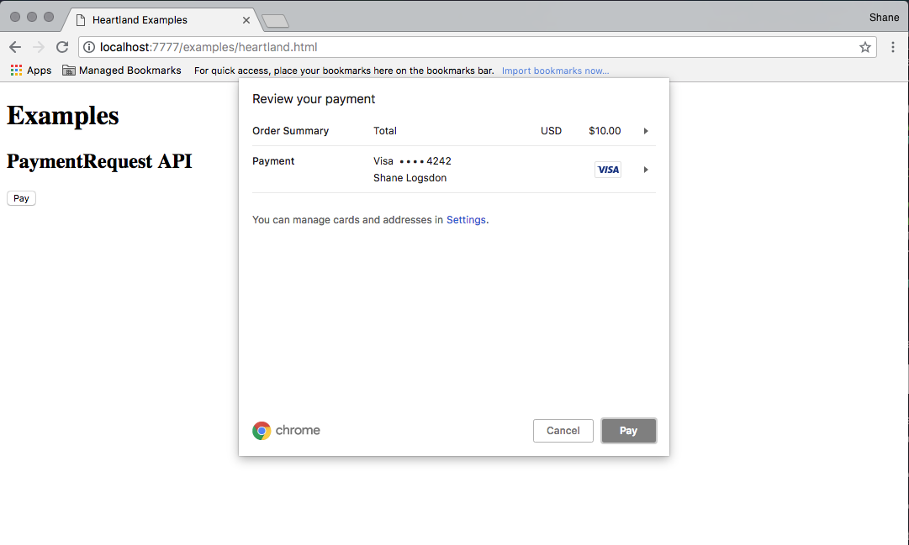
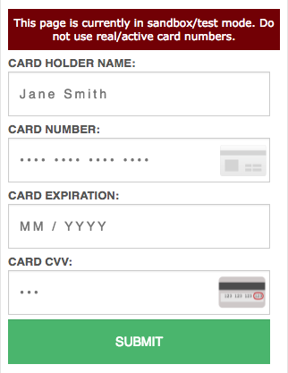
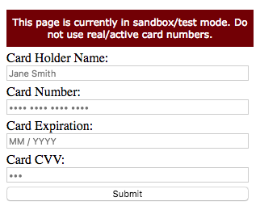
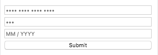
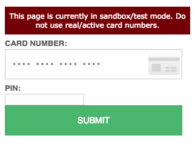
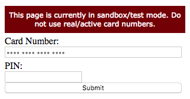
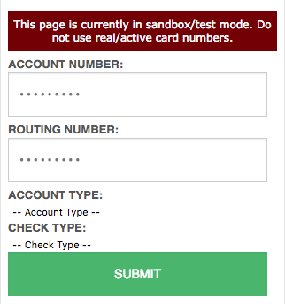
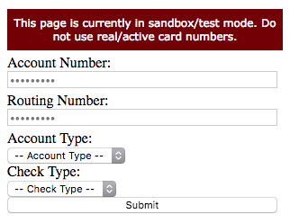
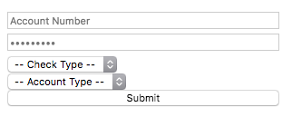

# Global Payments JavaScript Library

#### PCI Friendly Tokenization

This plugin allows you to use online payments (eCommerce) features of a variety of Global Payments brands &mdash; Heartland, Global Payments eCommerce, Cayan/Genius, TSYS, Global Payments Integration (fka OpenEdge) &mdash; to convert a credit card, gift card, or ACH/eCheck account into a secure token value which can be charged in a PCI friendly way.

## Table of Contents

- [Usage](#usage)
  - [Configuration](#configuration)
    - [Options](#options)
    - [Examples](#examples)
  - [Handling Global Errors](#handling-global-errors)
  - [Payment Request API](#payment-request-api)
  - [Payment Methods](#payment-methods)
    - [Credit/Debit Cards](#creditdebit-cards)
    - [Gift/Loyalty Cards](#giftloyalty-cards)
    - [ACH/eCheck Accounts](#achecheck-accounts)
- [Building from source](#building-from-source)
- [Development](#development)
- [Contributing](#contributing)
- [LICENSE](#license)

## Usage

```html
<script src="https://api2.heartlandportico.com/SecureSubmit.v1/token/gp-1.3.0/globalpayments.js"></script>
```

### Configuration

#### Options

##### `publicApiKey` - `string`

> Note: Applies to Heartland eCommerce only.

The public API key associated with the merchant account. This API key is tied to a specific merchant/teminal account combination at Heartland and requires a matching secret API key to consume this value.

##### `merchantId` - `string`

> Note: Applies to Global Payments eCommerce only.

The merchant ID value supplied by Global Payments eCommerce.

##### `account` - `string`

> Note: Applies to Global Payments eCommerce only.

The account ID value supplied by Global Payments eCommerce.

##### `env` - `string`

Supported values:

- `production`
- `sandbox` (default)

> Note: For Heartland eCommerce, this value is inferred from the configured `publicApiKey`.

##### `hash` - `(object) => Promise<object>`

> Note: Applies to Global Payments eCommerce only.

- input: JS object for the request
- output: A promise value that resolves to the into JS object with the correct SHA1 hash

The `hash` property depends on an asynchronous call to your backend to add the SHA1 hash to the JSON request using your account's shared secret. The Global Payments eCommerce configuration example below uses the Fetch API along with a PHP script, but this can use any other option as long as you are able to achieve the same result. This is required to prevent your shared secret from being exposed to unauthorized parties.

##### `customerExists` - `boolean` (Optional)

> Note: Applies to Global Payments eCommerce only.

If the consumer already has a customer record stored with Global Payments eCommerce, this value should be set to `true`.

##### `customerReference` - `string` (Optional)

> Note: Applies to Global Payments eCommerce only.

If `customerExists` is `true`, this should be set to the customer's reference value/ID (`PAYER_REF`).

##### `webApiKey` - `string` (Optional)

> Note: Applies to Genius Checkout only.

The API key associated with a given merchant account.

##### `deviceId` - `string` (Optional)

> Note: Applies to TransIT / TSEP only.

The device ID associated with a given account.

##### `manifest` - `string` (Optional)

> Note: Applies to TransIT / TSEP only.

An encrypted value generated by the integrating partner using the merchant ID, device ID, transaction amount, and transaction key.

##### `X-GP-Api-Key` - `string` (Optional)

> Note: Applies to OpenEdge / Global Payments Integrated only.

The API key associated with the account.

##### `X-GP-Environment` - `string` (Optional)

> Note: Applies to OpenEdge / Global Payments Integrated only.

The OpenEdge / Global Payments Integrated environment.

##### `merchantName` - `string` (Optional)

> Note: Applies to Heartland Bill Pay only.

The merchant name associated with a given account.

##### `accessToken` - `string` (Optional)

> Note: Applies to GP API only.

An access token created for an application. Requires the `PMT_POST_Create_Single` permission.

##### `accountName` - `string` (Optional)

> Note: Applies to GP API only.

The tokenization account name for the given merchant account. Only required if there are more than one tokenization account associated with the merchant account

##### `apiVersion` - `string` (Optional)

> Note: Applies to GP API only.

The target API version. Default is `2020-10-22`.

##### `reference` - `string` (Optional)

> Note: Applies to GP API only.

The transaction reference for the tokenization request. If not provided, a GUID is created and sent in the request.

#### Examples

##### Heartland eCommerce

```javascript
GlobalPayments.configure({
  publicApiKey: "pkapi_cert_dNpEYIISXCGDDyKJiV"
});
```

##### Global Payments eCommerce

```javascript
GlobalPayments.configure({
  merchantId: "merchant_id",
  account: "hpp",
  hash: (request) => {
    return fetch("/hash.php", {
      body: JSON.stringify(request),
      credentials: "omit",
      headers: new Headers({
        "Content-Type": "application/json",
      }),
      method: "POST",
    })
    .then((resp) => resp.json());
  },
  env: "sandbox"
});
```

#### Genius Checkout

```javascript
GlobalPayments.configure({
  webApiKey: "YU8PX7668FGMSH5L",
  env: "sandbox",
});
```

#### TransIT / TSEP

```javascript
GlobalPayments.configure({
  deviceId: "88700000322602",
  manifest: "3c26272b6769cfa8b0c3c5a14dda4fc5365ed75c7330233a221a6e82aec667f35513c70862dc34f4ca31de7b4c824e129d23f8bce035fbbaa55aeb9da07b5d90bfe5d53c",
  env: "sandbox",
});
```

#### OpenEdge / Global Payments Integrated

```javascript
GlobalPayments.configure({
  "X-GP-Api-Key": "oljHkRy0mAK9wqbQuUGZ9AUoe3ZtDrH7",
  "X-GP-Environment": "dev",
});
```

#### Heartland Bill Pay

```javascript
GlobalPayments.configure({
  merchantName: "IntegrationTesting",
  env: "sandbox",
});
```

### Handling Global Errors

The `GlobalPayments` global variable exposes an `on` function to attach event listeners for an internal event emitter. Global and/or parent window runtime errors are exposed through this, and `error` event handlers should follow the form:

```typescript
type ErrorEventHandler = (error: IErrorEvent) => void;
```

where `IErrorEvent` follows the form:

```javascript
{
  error: true,
  reasons: [{
    code,
    message,
  }],
}
```

#### Example

```javascript
GlobalPayments.on("error", (error) => {
  console.error(error);
});
```

### Payment Request API

The [Payment Request API](https://developer.mozilla.org/en-US/docs/Web/API/Payment_Request_API) defines a consistent user experience across payment methods, payment systems, platforms, and merchants. It is not a new payment method; rather, it is a conduit from the user's preferred payment method to a merchant. This functionality is driven by the user's browser and gives access to stored payment information associated with the user's browser session.

Here's a minimal example using a button and a simple $10 USD payment amount:

```html
<div>
  <button type="button" id="paymentRequestPlainButton" style="display: none">Pay</button>
</div>
```

```javascript
var paymentRequestForm = GlobalPayments.paymentRequest.setup("#paymentRequestPlainButton", {
  total: {
    label: "Total",
    amount: { value: 10, currency: "USD" }
  }
});

paymentRequestForm.on("token-success", function (resp) {
  // Payment data was successfully tokenized
  console.log(response);

  // TODO: POST data to backend for processing

  // Mark the payment as `success`, `fail`, or `unknown`
  // after processing response is known
  GlobalPayments.paymentRequest.complete("success");
});
paymentRequestForm.on("token-error", function (resp) {
  // An error occurred during tokenization
  console.log(resp);
});
paymentRequestForm.on("error", function (resp) {
  // An error occurred during setup or tokenization
  console.log(resp);
});
```

No additional styles are applied:


This will attach the necessary event handlers to start the Payment Request payment flow once the button is clicked:



### Payment Methods

This library currently supports:

- [Credit/Debit Cards](#creditdebit-cards)
- [Gift/Loyalty Cards](#giftloyalty-cards) (Heartland eCommerce only)
- [ACH/eCheck Accounts](#achecheck-accounts) (Heartland eCommerce only)

#### Credit/Debit Cards

The drop-in credit/debit card form makes it easy to get started. Your integration will need a HTML form with a target for the drop-in form:

```html
<form id="payment-form" action="/charge" method="get">
  <!-- Other input fields to capture relevant data -->
  <label for="billing-zip">Billing Zip Code</label>
  <input id="billing-zip" name="billing-zip" type="tel" />

  <!-- Target for the credit card form -->
  <div id="credit-card"></div>
</form>
```

and some JavaScript to setup the form:

```javascript
const cardForm = GlobalPayments.creditCard.form("#credit-card");

// form-level event handlers. examples:
cardForm.ready(() => {
  console.log("Registration of all credit card fields occurred");
});
cardForm.on("token-success", (resp) => {
  // add payment token to form as a hidden input
  const token = document.createElement("input");
  token.type = "hidden";
  token.name = "payment-reference";
  token.value = resp.paymentReference;

  // submit data to the integration's backend for processing
  const form = document.getElementById("payment-form");
  form.appendChild(token);
  form.submit();
});
cardForm.on("token-error", (resp) => {
  // show error to the consumer
});

// field-level event handlers. example:
cardForm.on("card-number", "register", () => {
  console.log("Registration of Card Number occurred");
});
```

This will create a form with our default styles on page load:



> See demo on [JSFiddle](https://jsfiddle.net/71bs39xu/2/)

If the default styles conflict with your desired UI/UX, you can opt-out by specifying the `blank` style:

```javascript
const cardForm = GlobalPayments.creditCard.form("#credit-card", { style: "blank" });
```



> See demo on [JSFiddle](https://jsfiddle.net/nvq26y4s/2/)

Styles can then be pushed to the form's fields as your integration requires:

```javascript
cardForm.addStylesheet({
  // You styles
});
```

Need even more control/flexibility? Your integration can leverage the raw card form builder:

```html
<form id="payment-form" action="/charge" method="get">
  <!-- Other input fields to capture relevant data -->
  <label for="billing-zip">Billing Zip Code</label>
  <input id="billing-zip" name="billing-zip" type="tel" />

  <!-- Targets for the credit card form's fields -->
  <div id="credit-card-card-holder"></div>
  <div id="credit-card-card-number"></div>
  <div id="credit-card-card-cvv"></div>
  <div id="credit-card-card-expiration"></div>
  <div id="credit-card-submit"></div>
</form>
```

```javascript
const cardForm = GlobalPayments.ui.form({
  fields: {
    "card-holder-name": {
      placeholder: "Jane Smith",
      target: "#credit-card-card-holder"
    },
    "card-number": {
      placeholder: "•••• •••• •••• ••••",
      target: "#credit-card-card-number"
    },
    "card-expiration": {
      placeholder: "MM / YYYY",
      target: "#credit-card-card-expiration"
    },
    "card-cvv": {
      placeholder: "•••",
      target: "#credit-card-card-cvv"
    },
    "submit": {
      value: "Submit",
    }
  },
  styles: {
    // Your styles
  }
});
```



> See demo on [JSFiddle](https://jsfiddle.net/dcy5wz2k/2/)

#### Gift/Loyalty Cards

> Note: Applies to Heartland eCommerce only.

The drop-in gift/loyalty card form makes it easy to get started. Your integration will need a HTML form with a target for the drop-in form:

```html
<form id="payment-form" action="/charge" method="get">
  <!-- Other input fields to capture relevant data -->
  <label for="billing-zip">Billing Zip Code</label>
  <input id="billing-zip" name="billing-zip" type="tel" />

  <!-- Target for the gift/loyalty card form -->
  <div id="gift-card"></div>
</form>
```

and some JavaScript to setup the form:

```javascript
const cardForm = GlobalPayments.giftAndLoyalty.form("#gift-card");

// form-level event handlers. examples:
cardForm.ready(() => {
  console.log("Registration of all gift/loyalty card fields occurred");
});
cardForm.on("token-success", (resp) => {
  // add payment token to form as a hidden input
  const token = document.createElement("input");
  token.type = "hidden";
  token.name = "payment-reference";
  token.value = resp.paymentReference;

  // submit data to the integration's backend for processing
  const form = document.getElementById("payment-form");
  form.appendChild(token);
  form.submit();
});
cardForm.on("token-error", (resp) => {
  // show error to the consumer
});

// field-level event handlers. example:
cardForm.on("card-number", "register", () => {
  console.log("Registration of Card Number occurred");
});
```

This will create a form with our default styles on page load:



> See demo on [JSFiddle](https://jsfiddle.net/1ajrtd7h/3/)

If the default styles conflict with your desired UI/UX, you can opt-out by specifying the `blank` style:

```javascript
const cardForm = GlobalPayments.giftAndLoyalty.form("#gift-card", { style: "blank" });
```



> See demo on [JSFiddle](https://jsfiddle.net/6412jupd/4/)

Styles can then be pushed to the form's fields as your integration requires:

```javascript
cardForm.addStylesheet({
  // You styles
});
```

Need even more control/flexibility? Your integration can leverage the raw card form builder:

```html
<form id="payment-form" action="/charge" method="get">
  <!-- Other input fields to capture relevant data -->
  <label for="billing-zip">Billing Zip Code</label>
  <input id="billing-zip" name="billing-zip" type="tel" />

  <!-- Targets for the gift/loyalty card form's fields -->
  <div id="gift-card-card-number"></div>
  <div id="gift-card-submit"></div>
</form>
```

```javascript
const cardForm = GlobalPayments.ui.form({
  fields: {
    "card-number": {
      placeholder: "•••• •••• •••• ••••",
      target: "#gift-card-card-number"
    },
    "submit": {
      value: "Submit",
      target: "#gift-card-submit"
    }
  },
  styles: {
    // Your styles
  }
});
```


> See demo on [JSFiddle](https://jsfiddle.net/yw0fh94t/3/)

#### ACH/eCheck Accounts

> Note: Applies to Heartland eCommerce only.

The drop-in ACH/eCheck form makes it easy to get started. Your integration will need a HTML form with a target for the drop-in form:

```html
<form id="payment-form" action="/charge" method="get">
  <!-- Other input fields to capture relevant data -->
  <label for="billing-zip">Billing Zip Code</label>
  <input id="billing-zip" name="billing-zip" type="tel" />

  <!-- Target for the ACH/eCheck form -->
  <div id="eCheck"></div>
</form>
```

and some JavaScript to setup the form:

```javascript
const eCheckForm = GlobalPayments.eCheck.form("#eCheck");

// form-level event handlers. examples:
eCheckForm.ready(() => {
  console.log("Registration of all ACH/eCheck fields occurred");
});
eCheckForm.on("token-success", (resp) => {
  // add payment token to form as a hidden input
  const token = document.createElement("input");
  token.type = "hidden";
  token.name = "payment-reference";
  token.value = resp.paymentReference;

  // submit data to the integration's backend for processing
  const form = document.getElementById("payment-form");
  form.appendChild(token);
  form.submit();
});
eCheckForm.on("token-error", (resp) => {
  // show error to the consumer
});

// field-level event handlers. example:
eCheckForm.on("account-number", "register", () => {
  console.log("Registration of Account Number occurred");
});
```

This will create a form with our default styles on page load:



> See demo on [JSFiddle](https://jsfiddle.net/abjv3q1m/2/)

If the default styles conflict with your desired UI/UX, you can opt-out by specifying the `blank` style:

```javascript
const eCheckForm = GlobalPayments.eCheck.form("#eCheck", { style: "blank" });
```



> See demo on [JSFiddle](https://jsfiddle.net/vh87suwp/)

Styles can then be pushed to the form's fields as your integration requires:

```javascript
eCheckForm.addStylesheet({
  // You styles
});
```

Need even more control/flexibility? Your integration can leverage the raw form builder:

```html
<form id="payment-form" action="/charge" method="get">
  <!-- Other input fields to capture relevant data -->
  <label for="billing-zip">Billing Zip Code</label>
  <input id="billing-zip" name="billing-zip" type="tel" />

  <!-- Targets for the gift/loyalty card form's fields -->
  <div id="eCheck-account-number"></div>
  <div id="eCheck-routing-number"></div>
  <div>
    <select name="eCheck-check-type">
      <option> -- Check Type -- </option>
      <option>Checking</option>
      <option>Savings</option>
    </select>
  </div>
  <div>
    <select name="eCheck-account-type">
      <option> -- Account Type -- </option>
      <option>Personal</option>
      <option>Business</option>
    </select>
  </div>
  <div id="eCheck-submit"></div>
</form>
```

```javascript
const eCheckForm = GlobalPayments.ui.form({
  fields: {
    "account-number": {
      placeholder: "Account Number",
      target: "#eCheck-account-number"
    },
    "routing-number": {
      placeholder: "•••••••••",
      target: "#eCheck-routing-number"
    },
    "submit": {
      value: "Submit",
      target: "#eCheck-submit"
    }
  },
  styles: {
    // Your styles
  }
});
```



> See demo on [JSFiddle](https://jsfiddle.net/zvn36p48/3/)

## Building from source

```bash
yarn install
yarn run build
```

`yarn run build` will perform the following tasks:

1. Clean the `./dist/` directory.
2. Lints the Typescript files according to `tslint.json`.
3. Builds the Typescript files into `./dist/securesubmit.js` using `tsconfig.json`.
4. Minifies `./dist/securesubmit.js` into `./dist/securesubmit.min.js`.
5. Copies the needed asset files into `./dist/`.

## Development

The tokenization library is built in Typescript. The Typescript compiler is available as an add-on for Visual Studio, but it can also be installed independently. This library's `package.json` file also pulls down a copy of the Typescript compiler on `yarn install`, which allows it to be used by calling `./node_modules/bin/tsc`.

### Watch files during development

```bash
yarn run build -w
```

### Testing

Integration tests are ran with Cypress, which expects a running web server to host the built files as well as the test runners. To facilitate this, leverage the appropriate Bash script:

```
./test/run.sh
```

or PowerShell script:

```
.\test\run.ps1
```

## Contributing

1. Fork it
2. Create your feature branch (`git checkout -b my-new-feature`)
3. Commit your changes (`git commit -am 'Add some feature'`)
4. Push to the branch (`git push origin my-new-feature`)
5. Create new Pull Request

## LICENSE

This project is licensed under the GPLv2 License. See [LICENSE.md](LICENSE.md) for details.
